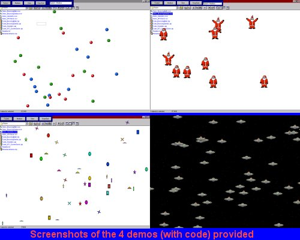



## Flickerless, Smooth Animation using pure VB with No OCXs, DLLs or ASM\!

### Description

Added New - Fully Functional Screensaver with source using my animation technique!

Also added one more new demo - Geometry.

Flickerless, Smooth Animation using pure VB with No OCXs, DLLs, ASM or DriectX. Pure VB. This Entry gives you the code that I created and have used in all of my screen savers for years. The code included is pure VB code (with just a few APIs declared and utilized).

Most of the code is in the "CodePage.Bas" module. This contains all of the initialization, variable definitions and declarations and animation code. If you like it, give me a vote or two.

If I get votes, I'll know you are interested and I'll create a complete documentation package around this.

Demos included are...

Demo_BouncingBalls.exe - About 30 colored balls bouncing all around the screen (Source included).

Demo_BouncingSantas.exe - Bunches of little Santas practicing thier jumping for the upcoming holiday season.

Demo_Geometry.exe - Bunches of geometric images floating around the screen.

Demo_UFO_ScreenSaver.Scr - Aliens have taken over your desk top.

All Demos have full source code in zip format.

UFOsaver.scr - A complete, fully functional screensaver using my animation techniques (source included)!!!

Thanks. Doug Puckett ( dpuckett@thelittleman.com )
 
### More Info
 

             |
---                |---
**Submitted On**   |2000-12-22 15:10:56
**By**             |[Douglas J\. Puckett](https://github.com/Planet-Source-Code/PSCIndex/blob/master/ByAuthor/douglas-j-puckett.md)
**Level**          |Advanced
**User Rating**    |4.9 (277 globes from 56 users)
**Compatibility**  |VB 6\.0
**Category**       |[Graphics](https://github.com/Planet-Source-Code/PSCIndex/blob/master/ByCategory/graphics__1-46.md)
**World**          |[Visual Basic](https://github.com/Planet-Source-Code/PSCIndex/blob/master/ByWorld/visual-basic.md)
**Archive File**   |[CODE\_UPLOAD1294712222000\.zip](https://github.com/Planet-Source-Code/douglas-j-puckett-flickerless-smooth-animation-using-pure-vb-with-no-ocxs-dlls-or-asm__1-13701/archive/master.zip)

### API Declarations

All in the source download

